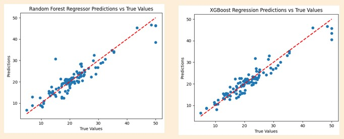
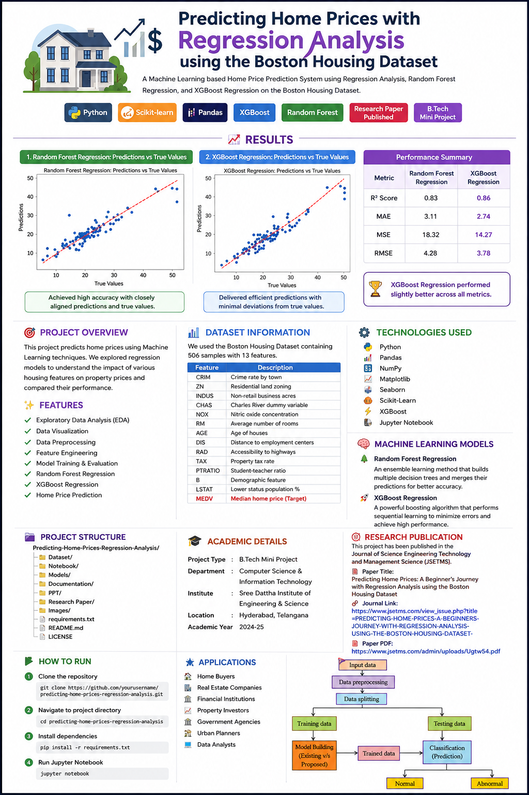

# 🏠 Predicting Home Prices with Regression Analysis using the Boston Housing Dataset

<p align="center">


</p>

<p align="center">
<b>A Machine Learning based Home Price Prediction System using Regression Analysis, Random Forest Regression, and XGBoost Regression on the Boston Housing Dataset.</b>

Developed as a <b>B.Tech Mini Project</b> and later published in an International Peer Reviewed Journal.
</p>

<p align="center">
  
</p>

---

# 📖 Table of Contents

- 📌 Project Overview
- ✨ Features
- 🎯 Objectives
- 🏗️ System Architecture
- 📂 Project Structure
- 📊 Dataset Information
- ⚙️ Technologies Used
- 🧠 Machine Learning Models
- 🔄 Workflow
- 📈 Results
- 📚 Research Publication
- 📰 Journal Details
- 🎓 Academic Documentation
- 📸 Project Presentation
- 💼 LinkedIn Showcase
- 🚀 Installation
- ▶️ Usage
- 📊 Future Improvements
- 👨‍💻 Authors
- 📜 License
- ⭐ Support

---

# 📌 Project Overview

Real estate valuation plays a crucial role in helping buyers, sellers, investors, financial institutions, and policymakers make informed decisions.

Traditional house price estimation often depends on manual analysis, market trends, and expert opinions. These approaches can be subjective and may fail to capture hidden relationships among various property features.

This project introduces a Machine Learning based prediction system that accurately estimates house prices using the famous **Boston Housing Dataset**.

The project explores multiple regression techniques, compares their performances, and demonstrates how Machine Learning can provide more reliable and scalable predictions.

---

# ✨ Features

✅ Exploratory Data Analysis (EDA)

✅ Data Visualization

✅ Data Preprocessing

✅ Feature Engineering

✅ Correlation Heatmap

✅ Train-Test Split

✅ Random Forest Regression

✅ XGBoost Regression

✅ Performance Evaluation

✅ Home Price Prediction

✅ Prediction on New Dataset

✅ Published Research Paper

---

# 🎯 Objectives

- Predict home prices using Machine Learning.
- Analyze important housing features affecting prices.
- Compare multiple regression models.
- Improve prediction accuracy using ensemble learning.
- Provide a scalable data-driven approach for real estate price estimation.
- Demonstrate practical implementation of Machine Learning algorithms.

---

# 🏗️ System Architecture
<div align="center">
  
```
                Boston Housing Dataset
                         │
                         ▼
              Data Preprocessing
                         │
                         ▼
         Exploratory Data Analysis (EDA)
                         │
                         ▼
          Feature Selection & Cleaning
                         │
                         ▼
             Train-Test Data Split
                         │
          ┌──────────────┴──────────────┐
          ▼                             ▼
 Random Forest Regression       XGBoost Regression
          │                             │
          └──────────────┬──────────────┘
                         ▼
              Model Evaluation
                         │
                         ▼
              Home Price Prediction
```
</div>
---

# 📂 Project Structure

```
Predicting-Home-Prices-Regression-Analysis
│
├── Dataset/
│
├── Notebook/
│
├── Models/
│
├── Documentation/
│
├── Research Paper/
│
├── PPT/
│
├── Images/
│
├── requirements.txt
│
├── README.md
│
└── LICENSE
```

---

# 📊 Dataset Information

## Dataset

**Boston Housing Dataset**

The dataset contains information collected from different suburbs of Boston.

### Features

| Feature | Description |
|----------|-------------|
| CRIM | Crime rate by town |
| ZN | Residential land zoning |
| INDUS | Non-retail business acres |
| CHAS | Charles River dummy variable |
| NOX | Nitric oxide concentration |
| RM | Average number of rooms |
| AGE | Age of houses |
| DIS | Distance to employment centers |
| RAD | Accessibility to highways |
| TAX | Property tax rate |
| PTRATIO | Student-teacher ratio |
| B | Demographic feature |
| LSTAT | Lower status population percentage |
| MEDV | Median home price (Target Variable) |

---

# ⚙️ Technologies Used

| Technology | Purpose |
|------------|----------|
| Python | Programming Language |
| Pandas | Data Analysis |
| NumPy | Numerical Computing |
| Matplotlib | Visualization |
| Seaborn | Statistical Visualization |
| Scikit-Learn | Machine Learning |
| XGBoost | Gradient Boosting |
| Jupyter Notebook | Development |

---

# 🧠 Machine Learning Models

## 🌳 Random Forest Regression

Random Forest is an ensemble learning algorithm that combines multiple Decision Trees to improve prediction accuracy while reducing overfitting.

### Advantages

- High Accuracy
- Handles Large Datasets
- Robust Against Overfitting
- Feature Importance Analysis

---

## 🚀 XGBoost Regression

XGBoost (Extreme Gradient Boosting) is one of the most powerful boosting algorithms used for structured data.

### Advantages

- Fast Training
- High Prediction Accuracy
- Regularization Support
- Handles Missing Data
- Excellent Performance

---

# 🔄 Project Workflow

```
Import Dataset
      │
      ▼
Data Cleaning
      │
      ▼
EDA
      │
      ▼
Feature Selection
      │
      ▼
Train-Test Split
      │
      ▼
Model Training
      │
      ▼
Performance Evaluation
      │
      ▼
Price Prediction
```

---

# 📈 Model Evaluation Metrics

The models were evaluated using:

- Mean Absolute Error (MAE)
- Mean Squared Error (MSE)
- Root Mean Squared Error (RMSE)
- R² Score

---

# 📊 Results

✔ Random Forest Regression achieved highly accurate predictions.

✔ XGBoost Regression produced excellent prediction performance with minimal deviation.

✔ The project successfully demonstrated that Machine Learning can effectively estimate housing prices using historical housing data.

---

# 🎯 Applications

🏠 Home Buyers

🏢 Real Estate Companies

🏦 Financial Institutions

📈 Property Investors

🏛 Government Agencies

🏗 Urban Planners

📊 Data Analysts

---

# 📚 Research Publication

> **This project has been officially published in an International Peer Reviewed Journal.** 🎉

## 📄 Paper Title

**Predicting Home Prices: A Beginner's Journey with Regression Analysis using the Boston Housing Dataset**

---

## 👨‍💻 Authors

- **S. Puneeth**
- **Md. Ammaar Quadri**
- **M. Sahithi**
- **Mohd. Arbas**
- **P.S. Jyothi**

---

## 📰 Journal

**Journal of Science Engineering Technology and Management Science (JSETMS)**

**ISSN:** 3049-0952

**Volume:** 02

**Issue:** 06

**Month:** June 2025


---

## 🌐 Journal Article

https://www.jsetms.com/view_issue.php?title=PREDICTING-HOME-PRICES-A-BEGINNERS-JOURNEY-WITH-REGRESSION-ANALYSIS-USING-THE-BOSTON-HOUSING-DATASET-

---

## 📄 Research Paper PDF

https://www.jsetms.com/admin/uploads/Ugtw54.pdf

---

# 🏆 Publication Highlights

✅ Published in an International Journal

✅ Peer Reviewed Research

✅ Machine Learning Application

✅ Real-world Dataset

✅ Academic Contribution

---

# 🎓 Academic Project

**Project Type**

B.Tech Mini Project

**Department**

Computer Science & Information Technology

**Institution**

Sree Dattha Institute of Engineering & Science

Sheriguda, Telangana

Academic Year: **2024-25**

---

# 📑 Documentation

This repository includes:

📘 Project Documentation

📄 Published Research Paper

📊 PowerPoint Presentation

💻 Source Code

---

# 📸 Presentation

The PowerPoint presentation included in this repository explains:

- Introduction
- Motivation
- Objectives
- Dataset
- Architecture
- Models
- Results
- Conclusion

---

# 💼 LinkedIn Showcase

## 🎉 Publication Announcement

https://www.linkedin.com/posts/ammaarquadri_%F0%9D%94%B8%F0%9D%95%9E%F0%9D%95%9E%F0%9D%95%92%F0%9D%95%92%F0%9D%95%A3%F0%9D%95%A4-%F0%9D%95%84%F0%9D%95%9A%F0%9D%95%9F%F0%9D%95%9A-%F0%9D%95%A1%F0%9D%95%A3%F0%9D%95%A0%F0%9D%95%9B%F0%9D%95%96%F0%9D%95%94%F0%9D%95%A5-%F0%9D%94%B8%F0%9D%95%A3%F0%9D%95%A5%F0%9D%95%9A%F0%9D%95%94%F0%9D%95%9D%F0%9D%95%96-activity-7391390180361920513-fDPW

---

## 🎓 Combined Publications

https://www.linkedin.com/posts/ammaarquadri_research-machinelearning-ai-activity-7391397227795050496-wCEu

---

## 🎥 Project Showcase

https://www.linkedin.com/posts/ammaarquadri_machinelearning-datascience-miniproject-activity-7327761923679145985-LGKp

---

# 🚀 Installation

Clone the repository

```bash
git clone https://github.com/yourusername/predicting-home-prices-regression-analysis.git
```

Go to project folder

```bash
cd predicting-home-prices-regression-analysis
```

Install dependencies

```bash
pip install -r requirements.txt
```

Run

```bash
python app.py
```

or

```bash
jupyter notebook
```

---

# 📊 Future Improvements

- Deep Learning Models
- Hyperparameter Optimization
- Streamlit Web Application
- Flask Deployment
- Cloud Deployment
- Larger Housing Datasets
- Feature Engineering
- Explainable AI (SHAP/LIME)

---

# 👨‍💻 Authors

### 👨‍🎓 Student Team

**Md. Ammaar Quadri**

**M. Sahithi**

**Mohd. Arbas**

**P.S. Jyothi**

---

### 👨‍🏫 Project Guide

**S. Puneeth**

Assistant Professor

---

# 📜 License

This repository is intended for **educational and research purposes**.

Feel free to fork, learn, and build upon this project by giving proper credit to the original authors.

---

# ⭐ If you like this project...

Give this repository a ⭐

It motivates us to build more Machine Learning and AI projects.

---

# 📬 Connect with Me

**LinkedIn**

https://www.linkedin.com/in/ammaarquadri/

---

# 🗺️ Complete Workflow Overview

<p align="center">
  
</p>

<div align="center">

<h3>⭐ If this project helped you, don't forget to Star the repository ⭐</h3>

<p>
Made with ❤️ using Python, Machine Learning, Data Science, Random Forest, and XGBoost
</p>

</div>
